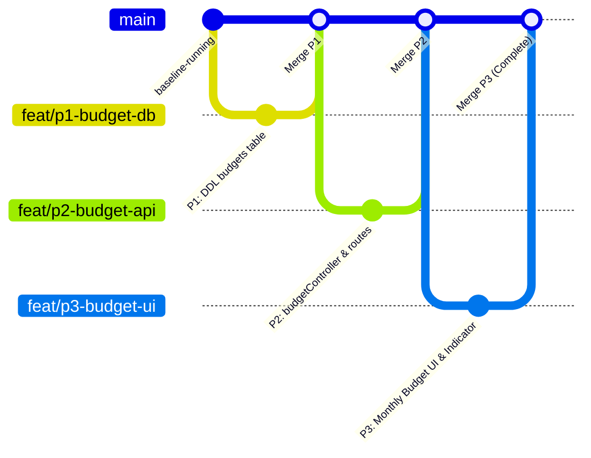

# CONFLICT_RESOLUTION.md — Panduan Kerja Paralel & Alur Merge Cepat

**Proyek:** SakuGue (ppk2-kel8 — Expense Tracker & Monthly Budget)  
**Penyusun:** Project Manager (PM)  
**Prinsip Utama:** *Zero Collision, Zero Waiting, Immediate Merge*  

---

## 1. Strategi Paralel Tanpa Menunggu (Non-Blocking Architecture)

Agar ketiga programmer dapat mulai bekerja pada detik yang sama tanpa saling tunggu:

```
+--------------------+-------------------------------------------+-----------------------------------------------+
| Programmer         | Tugas & Wilayah File                      | Kenapa Tidak Perlu Menunggu?                  |
+--------------------+-------------------------------------------+-----------------------------------------------+
| **Programmer 1**   | - Skema `budgets` di `src/db/initDb.js`   | Bekerja independen di inisialisasi DDL        |
| (DB Core)          |                                           | database.                                     |
+--------------------+-------------------------------------------+-----------------------------------------------+
| **Programmer 2**   | - `src/controllers/budgetController.js`   | Bekerja dengan acuan kontrak query SQL        |
| (Backend API)      | - `src/routes/budgetRoutes.js`            | di `docs/DB_CONTRACT.md`. Query SQL sudah     |
|                    | - `tests/budget.test.js`                  | difinalisasi di dokumen kontrak.              |
+--------------------+-------------------------------------------+-----------------------------------------------+
| **Programmer 3**   | - `finance-frontend/src/main.jsx`         | Bekerja dengan acuan response JSON di         |
| (Frontend UI)      | - `finance-frontend/src/styles.css`       | `docs/MODEL_GUIDE.md`. Dapat mengetes UI      |
|                    |                                           | dengan mock data tanpa nunggu backend live.   |
+--------------------+-------------------------------------------+-----------------------------------------------+
```

---

## 2. Alur Kerja Git: Abis Push Langsung Merge!

Karena ketiga programmer menyentuh file yang 100% berbeda, proses merge ke branch `main` dapat dilakukan secara langsung tanpa ada merge conflict.

### Diagram Alur Merge:



### Prosedur Terminal Tiap Programmer:

#### Langkah Programmer 1 (DB):
```bash
git checkout -b feat/p1-budget-db
# Edit src/db/initDb.js
git commit -am "[P1] Add budgets table schema and index"
git push origin feat/p1-budget-db
# LANGSUNG MERGE KE MAIN
git checkout main
git pull origin main
git merge feat/p1-budget-db
git push origin main
```

#### Langkah Programmer 2 (API):
```bash
git checkout -b feat/p2-budget-api
# Buat budgetController.js, budgetRoutes.js, tests/budget.test.js
npm test
git commit -am "[P2] Implement budget API and calculation logic"
git push origin feat/p2-budget-api
# LANGSUNG MERGE KE MAIN
git checkout main
git pull origin main
git merge feat/p2-budget-api
git push origin main
```

#### Langkah Programmer 3 (UI):
```bash
git checkout -b feat/p3-budget-ui
# Buat BudgetPage, Monthly Picker, Indicator Bar di finance-frontend/
git commit -am "[P3] Implement Monthly Budget UI and Indicator"
git push origin feat/p3-budget-ui
# LANGSUNG MERGE KE MAIN
git checkout main
git pull origin main
git merge feat/p3-budget-ui
git push origin main
```

---

## 3. Resolusi Jika Terjadi Anomali
1. Jika terjadi conflict kecil pada file aggregator (`src/app.js`):
   - P2 hanya menambahkan baris: `app.use('/api/budgets', budgetRoutes);`.
   - Gunakan versi *incoming change* yang menyertakan kedua rute.
2. Jika ada bug data:
   - Pastikan database PostgreSQL tetap menggunakan database `sakugue` di port `5432`.
   - Jalankan `npm test` untuk memverifikasi seluruh endpoint.
