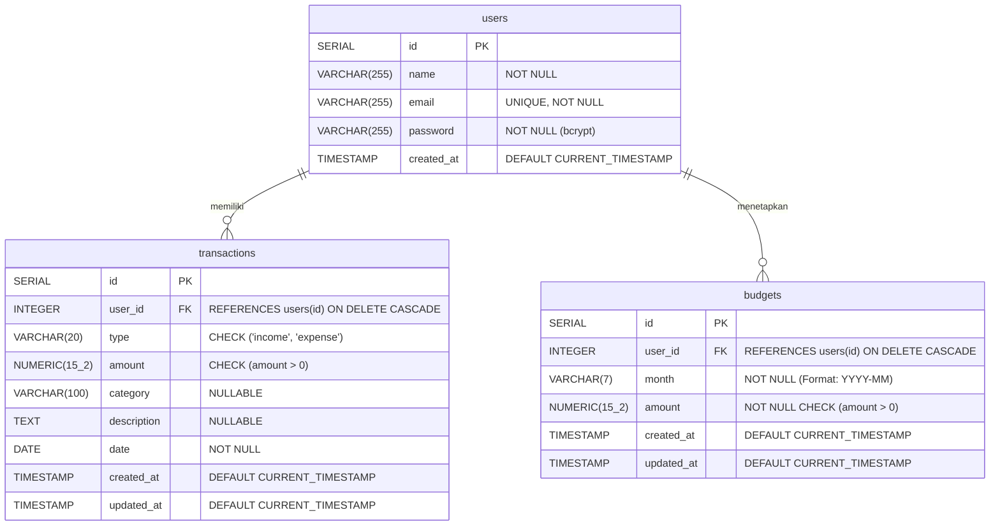

# DB_CONTRACT.md — Kontrak Database & Skema Relasional SakuGue

**Proyek:** SakuGue (ppk2-kel8 — Expense Tracker & Monthly Budget)  
**Database Engine:** PostgreSQL 15+  
**Dialek & Driver:** Node.js `pg` (`node-postgres` Pool)  
**Status Skema:** FINAL & TERKUNCI MINGGU INI  

Dokumen ini mendefinisikan seluruh struktur tabel, tipe data, relasi, batasan integritas, dan query agregasi resmi untuk aplikasi SakuGue.

---

## 1. Entity Relationship Diagram (ERD)



---

## 2. DDL Migrasi Database (`src/db/initDb.js`)

Semua tabel wajib dideklarasikan secara idempotent (`IF NOT EXISTS`):

```sql
-- 1. Tabel users
CREATE TABLE IF NOT EXISTS users (
  id SERIAL PRIMARY KEY,
  name VARCHAR(255) NOT NULL,
  email VARCHAR(255) UNIQUE NOT NULL,
  password VARCHAR(255) NOT NULL,
  created_at TIMESTAMP WITH TIME ZONE DEFAULT CURRENT_TIMESTAMP
);

-- 2. Tabel transactions
CREATE TABLE IF NOT EXISTS transactions (
  id SERIAL PRIMARY KEY,
  user_id INTEGER NOT NULL REFERENCES users(id) ON DELETE CASCADE,
  type VARCHAR(20) NOT NULL CHECK (type IN ('income', 'expense')),
  amount NUMERIC(15, 2) NOT NULL CHECK (amount > 0),
  category VARCHAR(100),
  description TEXT,
  date DATE NOT NULL,
  created_at TIMESTAMP WITH TIME ZONE DEFAULT CURRENT_TIMESTAMP,
  updated_at TIMESTAMP WITH TIME ZONE DEFAULT CURRENT_TIMESTAMP
);

CREATE INDEX IF NOT EXISTS idx_transactions_user_id ON transactions(user_id);
CREATE INDEX IF NOT EXISTS idx_transactions_user_date ON transactions(user_id, date);

-- 3. Tabel budgets (FITUR MINGGU INI)
CREATE TABLE IF NOT EXISTS budgets (
  id SERIAL PRIMARY KEY,
  user_id INTEGER NOT NULL REFERENCES users(id) ON DELETE CASCADE,
  month VARCHAR(7) NOT NULL, -- Format wajib 'YYYY-MM', misal: '2026-10'
  amount NUMERIC(15, 2) NOT NULL CHECK (amount > 0),
  created_at TIMESTAMP WITH TIME ZONE DEFAULT CURRENT_TIMESTAMP,
  updated_at TIMESTAMP WITH TIME ZONE DEFAULT CURRENT_TIMESTAMP,
  CONSTRAINT unique_user_monthly_budget UNIQUE (user_id, month)
);

CREATE INDEX IF NOT EXISTS idx_budgets_user_month ON budgets(user_id, month);
```

---

## 3. Kamus Data Rinci

### A. Tabel `users`
| Kolom | Tipe Data | Constraint | Keterangan |
|---|---|---|---|
| `id` | `SERIAL` | `PRIMARY KEY` | ID unik pengguna |
| `name` | `VARCHAR(255)` | `NOT NULL` | Nama lengkap pengguna |
| `email` | `VARCHAR(255)` | `UNIQUE, NOT NULL` | Email untuk login (case-insensitive) |
| `password` | `VARCHAR(255)` | `NOT NULL` | Hash bcrypt (salt rounds 10), tidak boleh dikembalikan ke client |
| `created_at`| `TIMESTAMPTZ` | `DEFAULT NOW()` | Waktu registrasi |

### B. Tabel `transactions`
| Kolom | Tipe Data | Constraint | Keterangan |
|---|---|---|---|
| `id` | `SERIAL` | `PRIMARY KEY` | ID unik transaksi |
| `user_id` | `INTEGER` | `FK -> users(id) CASCADE`| Pemilik transaksi (wajib dari sesi) |
| `type` | `VARCHAR(20)` | `CHECK ('income', 'expense')` | Jenis transaksi |
| `amount` | `NUMERIC(15,2)`| `CHECK (amount > 0)` | Nominal uang |
| `category` | `VARCHAR(100)`| `NULLABLE` | Kategori (Makanan, Transport, dll) |
| `description`| `TEXT` | `NULLABLE` | Catatan transaksi |
| `date` | `DATE` | `NOT NULL` | Tanggal transaksi (`YYYY-MM-DD`) |
| `created_at`| `TIMESTAMPTZ` | `DEFAULT NOW()` | Waktu pembuatan |
| `updated_at`| `TIMESTAMPTZ` | `DEFAULT NOW()` | Waktu pembaruan |

### C. Tabel `budgets` (New Feature)
| Kolom | Tipe Data | Constraint | Keterangan |
|---|---|---|---|
| `id` | `SERIAL` | `PRIMARY KEY` | ID unik anggaran bulanan |
| `user_id` | `INTEGER` | `FK -> users(id) CASCADE`| Pemilik anggaran (wajib dari sesi) |
| `month` | `VARCHAR(7)` | `NOT NULL` | Bulan anggaran (`YYYY-MM`, contoh: `2026-10`) |
| `amount` | `NUMERIC(15,2)`| `CHECK (amount > 0)` | Target anggaran pengeluaran bulan tersebut |
| `created_at`| `TIMESTAMPTZ` | `DEFAULT NOW()` | Waktu penentuan anggaran |
| `updated_at`| `TIMESTAMPTZ` | `DEFAULT NOW()` | Waktu pengubahan anggaran |
| `UNIQUE` | `(user_id, month)` | Satu pengguna hanya boleh memiliki 1 record anggaran per bulan |

---

## 4. Query Standar SQL (Fitur Budget Bulanan)

### 1. Upsert Budget (Set & Update Budget):
```sql
INSERT INTO budgets (user_id, month, amount, updated_at)
VALUES ($1, $2, $3, CURRENT_TIMESTAMP)
ON CONFLICT (user_id, month)
DO UPDATE SET 
  amount = EXCLUDED.amount,
  updated_at = CURRENT_TIMESTAMP
RETURNING id, user_id, month, amount, created_at, updated_at;
```

### 2. Ambil Budget & Hitung Total Pengeluaran Bulan Terpilih (Budget Summary & Indicator):
```sql
-- $1 = userId, $2 = month (misal: '2026-10')
WITH monthly_expense AS (
  SELECT COALESCE(SUM(amount), 0) AS total_expense
  FROM transactions
  WHERE user_id = $1 
    AND type = 'expense'
    AND TO_CHAR(date, 'YYYY-MM') = $2
),
user_budget AS (
  SELECT id, month, amount AS budget_amount
  FROM budgets
  WHERE user_id = $1 AND month = $2
)
SELECT 
  ub.id,
  $2 AS month,
  COALESCE(ub.budget_amount, 0) AS budget_amount,
  me.total_expense,
  (COALESCE(ub.budget_amount, 0) - me.total_expense) AS remaining_budget,
  CASE 
    WHEN COALESCE(ub.budget_amount, 0) = 0 THEN 0
    ELSE ROUND((me.total_expense / ub.budget_amount) * 100, 2)
  END AS percentage_used
FROM monthly_expense me
LEFT JOIN user_budget ub ON true;
```

### 3. Logika Budget Indicator:
- `percentage_used < 80%` ➔ Status: `'normal'` (Indikator Hijau / Aman)
- `80% <= percentage_used <= 100%` ➔ Status: `'warning'` (Indikator Kuning / Mendekati Limit)
- `percentage_used > 100%` ➔ Status: `'exceeded'` (Indikator Merah / Overbudget)
